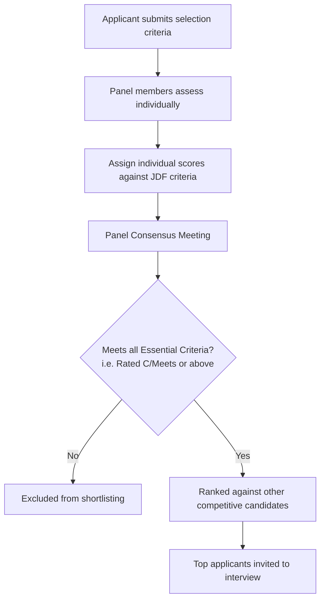

# WA Government Selection Criteria Guide

This guide provides a distilled, best-practice framework for writing high-quality and concise selection criteria responses for Western Australian (WA) government roles. It is aligned with the guidelines of the **WA Public Sector Commission (PSC)** and the standard practices used on **jobs.wa.gov.au**.

---

## 1. Scoring-Minded Strategy (Understanding the Panel)

WA Government recruitment operates under the **Public Sector Commissioner's Instruction No. 1: Employment Standard**, which requires merit-based, transparent decision-making. 

### How Panels Evaluate Your Application
Selection panels evaluate your responses using a structured assessment grid. Understanding this grading system is key to drafting competitive responses:



*   **The Consensus Rating Scale:** Panels typically grade each work-related requirement on a standard scale:
    *   **A – Greatly exceeds the requirement:** The applicant provides exceptional evidence of leadership, high-level action, and substantial, quantifiable business improvements.
    *   **B – Exceeds the requirement:** The applicant provides clear evidence of action that goes beyond standard duties, with positive organizational outcomes.
    *   **C – Meets the requirement:** The applicant provides sufficient evidence showing they have performed the duties and achieved the basic requirements (minimum threshold to be considered "suitable").
    *   **D – Does not meet the requirement:** The applicant lacks evidence, uses vague phrasing, or only claims capability ("I can") rather than demonstrating it ("I have").
*   **The Threshold Rule:** You must score at least a **"C" (Meets)** on **every single essential criterion** to be considered for shortlisting. Scoring an "A" on three criteria and a "D" on one means you cannot be shortlisted.
*   **"I Have" vs. "I Can":** Panels score based on historical evidence. Vague assertions like *"I can manage budgets"* or *"I am an excellent communicator"* score a **D**. Instead, you must write *"I managed the $250k project budget by..."* to score a **C** or above.

---

## 2. Structure: The SAO Framework

While the **STAR** (Situation, Task, Action, Result) method is widely known, the **SAO** (Situation, Action, Outcome) method is preferred for WA Government applications where word limits or page limits are strict.

To maximize your score, allocate your word count according to where the panel assigns points:

| Component | Target Word Count % | Scoring Focus | Description |
| :--- | :--- | :--- | :--- |
| **Situation (S)** | **15% – 20%** | Context Only | Set the scene. Explain the context, your role, and the core challenge. Keep it brief—do not get bogged down in background details. |
| **Action (A)** | **60% – 70%** | **High (Primary Score Source)** | Explain exactly *what* you did, *how* you did it, and *why*. Focus on your individual actions (use "I", not "we"). |
| **Outcome (O)** | **15% – 20%** | **High (Validation of Action)** | State the result. Quantify the impact using data, feedback, or organizational benefits. Connect it back to the JDF's objectives. |

> [!TIP]
> **The Golden Action Rule:** Panels score your *Action* section. If you spend 80% of your words explaining the "Situation" and only 20% on your "Action", you will score poorly. Focus heavily on your steps, strategies, and methodologies.

---

## 3. Recommended Response Templates

WA Government job ads usually request either **individual criteria responses** (e.g., 1 page per criterion) or an **integrated cover letter** (e.g., a "2-page statement addressing the criteria"). Use the templates below accordingly.

### Template A: Individual Criterion Response (Structured SAO)
Use this template when addressing work-related requirements separately in a statement of claim.

```markdown
### Criterion [Number]: [Insert Criterion Title from JDF, e.g., Well-developed communication and interpersonal skills]

**[Situation - 15-20% of response]**
In my role as [Your Job Title] at [Agency/Organization], I was tasked with [describe the challenge, project, or goal]. This required me to [explain the core problem or why this criterion was necessary].
*Tip: Set the scene in 2-3 sentences. Identify the stakes.*

**[Action - 60-70% of response]**
To address this, I initiated the following steps:
*   **[Sub-action 1: Strategy/Planning]:** First, I [explain what you analyzed or how you planned your approach].
*   **[Sub-action 2: Execution/Communication]:** I then [explain the main action you took, including who you engaged with, what tools or frameworks you used, and how you managed obstacles].
*   **[Sub-action 3: Monitor/Quality Control]:** I ensured ongoing success by [describe how you monitored progress, adjusted your approach, or coached others].
*Tip: Use strong active verbs. Make sure the panel can visualize you doing the work.*

**[Outcome - 15-20% of response]**
As a result of these actions:
*   [Quantifiable/Qualitative Result 1, e.g., Project delivered 2 weeks ahead of schedule and 10% under budget].
*   [Quantifiable/Qualitative Result 2, e.g., Stakeholder feedback indicated 95% satisfaction rate, and the process was adopted agency-wide].
This demonstrated my ability to [rephrase the criterion title] within a complex public sector environment.
```

### Template B: Integrated Statement of Claim / Cover Letter
Use this template when the advertisement asks for a "statement of no more than 2 pages" addressing all criteria.

```markdown
[Date]
[Hiring Manager Name / Recipient]
[Agency Name]
[Agency Address]

**RE: Application for [Position Title] (Pool Ref: [Vacancy Number])**

Dear Selection Panel,

I am writing to express my strong interest in the [Position Title] role within [Agency Name]. With [Number] years of experience in [Your Field], particularly in [mention a key public sector context or skill], I bring a proven track record of [mention 1-2 major achievements aligned with the agency's goals].

Below, I demonstrate my suitability for this role against the work-related requirements:

#### 1. Shapes and Manages Strategy / Achieves Results
*   **Situation:** At [Agency], we faced a challenge where [describe situation].
*   **Action:** I designed and implemented a [describe action, e.g., project plan/strategy], which involved [describe your specific steps, methodologies, and stakeholder engagement].
*   **Outcome:** This resulted in [state quantifiable outcome, e.g., 20% reduction in processing times and alignment with the department's strategic plan].

#### 2. Builds Productive Relationships / Communicates Effectively
*   **Situation:** During [Context], I was responsible for aligning diverse stakeholders on [describe issue].
*   **Action:** I established a [describe action, e.g., regular consultation group], adapted my communication style by [explain how you tailored your message], and negotiated [explain resolution].
*   **Outcome:** Consequently, [state outcome, e.g., secured buy-in from all 5 departments and signed a service level agreement].

#### 3. Exemplifies Personal Integrity / Role-Specific Requirements
*   **Situation:** I encountered a complex issue involving [describe challenge, e.g., compliance, sensitive data, or high-risk decision].
*   **Action:** Adhering to the [mention relevant policy, e.g., WA Public Sector Code of Ethics / Agency Policy], I [explain the ethical steps, risk assessment, and transparent processes you undertook].
*   **Outcome:** As a result, the issue was resolved with [state outcome, e.g., zero compliance breaches and established a benchmark for future transactions].

Thank you for considering my application. I look forward to the opportunity to discuss how my skills and experience align with the needs of [Agency Name] at an interview.

Sincerely,

[Your Name]
[Your Phone Number]
[Your Email Address]
[Your LinkedIn Profile]
```

---

## 4. Weak vs. Strong Phrasing Examples

Panels review dozens of applications. Vague, passive, or team-centric phrasing is the most common reason applications fail to make the shortlist.

| Weak Phrasing (Scores C- or D) | Strong Phrasing (Scores B or A) | Rationale |
| :--- | :--- | :--- |
| "I was involved in the implementation of the new database system." | "I **led the data migration phase** of the database implementation, writing the migration scripts and coordinating testing." | **Weak** hides your contribution. **Strong** defines your exact role and activities. |
| "We successfully delivered the project on time." | "I developed the project schedule and monitored key milestones, resulting in **on-time delivery of the project within the $50k budget**." | **Weak** attributes success to a collective "we" (the panel cannot score the team). **Strong** highlights *your* contribution and quantifies the output. |
| "I have excellent written and verbal communication skills." | "I drafted the ministerial briefing note on [Topic] and presented the key findings to the executive team, **securing approval for the strategy**." | **Weak** is a subjective self-claim. **Strong** provides evidence of communication in action (drafting briefs, presenting) and the result (approval). |
| "I can manage difficult stakeholders using conflict resolution techniques." | "When a supplier delayed deliverables, I **initiated a face-to-face negotiation** and established a revised SLA, **saving 3 weeks of project downtime**." | **Weak** is theoretical ("I can"). **Strong** is evidence-based and shows real-world impact. |

---

## 5. Editing Checklist: The 10-Point Concise Polish

Before submitting, run your response through this checklist to ensure maximum clarity and impact:

1.  [ ] **Active Voice:** Are sentences written in the active voice? *(e.g., "I managed the project" instead of "The project was managed by me")*
2.  [ ] **Strong Verbs:** Did you replace generic verbs like *assisted*, *coordinated*, or *participated* with high-impact verbs like *engineered*, *negotiated*, *designed*, *spearheaded*, or *formulated*?
3.  [ ] **No Fluff / Clear Scene:** Is the "Situation" section restricted to 3 sentences or less?
4.  [ ] **First-Person Pronouns:** Does the response use "I" instead of "we" or "the team" when describing actions?
5.  [ ] **JDF Keyword Alignment:** Have you matched key verbs and terminology directly from the Job Description Form (JDF)?
6.  [ ] **Quantified Outcomes:** Is there a tangible outcome for every example? *(e.g., % time saved, dollar value managed, stakeholder satisfaction, compliance rate)*
7.  [ ] **No Acronyms:** Have you spelled out all agency-specific acronyms on first use? *(Selection panels may contain external representatives who do not know internal jargon)*
8.  [ ] **Word / Page Counts:** Does your response comply strictly with the limits stated in the job ad? *(e.g., 2-page limit means exactly 2 pages or less, never 2.1 pages)*
9.  [ ] **Capability Match:** Does your example align with the correct capability level? *(Check the WA PSC Capability Profile for your level (1 to 9) to ensure your example isn't too junior or senior)*
10. [ ] **Readability Check:** Are long paragraphs broken down using bullet points for key actions or outcomes to help panel members scan and score quickly?

---

## 6. Official WA Gov Source References

For further details and to ensure compliance with the latest public sector frameworks, consult:

*   **WA Public Sector Commission - Commissioner’s Instruction No. 1: Employment Standard:** [WA PSC Commissioner's Instructions](https://www.wa.gov.au/government/publications/commissioners-instruction-1-employment-standard) (Governs merit-based recruitment).
*   **WA Public Sector Commission - Public Sector Capability Profiles:** [Public Sector Capability Profiles](https://www.wa.gov.au/government/publications/public-sector-capability-profiles) (Provides details on the 5 core capabilities for Levels 1–6).
*   **WA Public Sector Commission - Leadership Capability Profiles:** [Leadership Capability Profiles](https://www.wa.gov.au/government/publications/leadership-capability-profile) (For Level 7 to Class 4 roles).
*   **Jobs.wa.gov.au - Applicant Information Pack:** Refer to the standard information pack attached to individual vacancy advertisements on the Jobs WA board.
